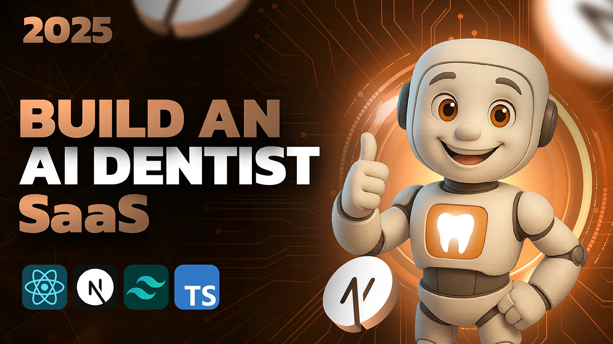

# AI Dentist

AI-powered dental care platform providing instant consultations, personalized treatment plans, and expert dental advice through cutting-edge artificial intelligence technology.



## Features

- **AI-Powered Consultations** - Get instant dental assessments using advanced AI algorithms
- **Personalized Treatment Plans** - Receive customized treatment recommendations based on your specific needs
- **Expert Dental Advice** - Access professional dental guidance 24/7
- **Progress Tracking** - Monitor your oral health journey with detailed reports
- **Secure Health Records** - Keep your dental history safe and accessible
- **Emergency Support** - 24/7 emergency consultation for urgent dental issues

## Technology Stack

- **Frontend**: Next.js 15.5.4 with React 19.1.0
- **Styling**: Tailwind CSS 4 with shadcn/ui components
- **Authentication**: Clerk for secure user management
- **Database**: PostgreSQL with Prisma ORM
- **State Management**: TanStack Query for server state
- **Form Handling**: React Hook Form with Zod validation

## Getting Started

### Prerequisites

- Node.js 18+
- PostgreSQL database
- Clerk account for authentication

### Installation

1. Clone the repository:

```bash
git clone https://github.com/your-username/ai-dentist.git
cd ai-dentist
```

2. Install dependencies:

```bash
npm install
```

3. Set up environment variables:

```bash
cp .env.example .env
```

Fill in your environment variables:

- `DATABASE_URL` - PostgreSQL connection string
- `NEXT_PUBLIC_CLERK_PUBLISHABLE_KEY` - Clerk publishable key
- `CLERK_SECRET_KEY` - Clerk secret key

4. Set up the database:

```bash
npx prisma generate
npx prisma db push
```

5. Run the development server:

```bash
npm run dev
```

Open [http://localhost:3000](http://localhost:3000) to see the application.

## Available Scripts

- `npm run dev` - Start development server
- `npm run build` - Build for production
- `npm run start` - Start production server
- `npm run lint` - Run ESLint
- `npx prisma studio` - Open Prisma Studio for database management

## Project Structure

```
ai-dentist/
├── src/
│   ├── app/                 # Next.js App Router pages
│   ├── components/          # Reusable React components
│   ├── hooks/              # Custom React hooks
│   └── lib/                # Utility libraries
├── prisma/                 # Database schema and migrations
├── public/                 # Static assets
└── README.md
```

## Contributing

1. Fork the repository
2. Create your feature branch (`git checkout -b feature/amazing-feature`)
3. Commit your changes (`git commit -m 'Add some amazing feature'`)
4. Push to the branch (`git push origin feature/amazing-feature`)
5. Open a Pull Request

## License

This project is licensed under the MIT License - see the [LICENSE](LICENSE) file for details.

## Support

For support, email support@ai-dentist.com or join our community forum.
